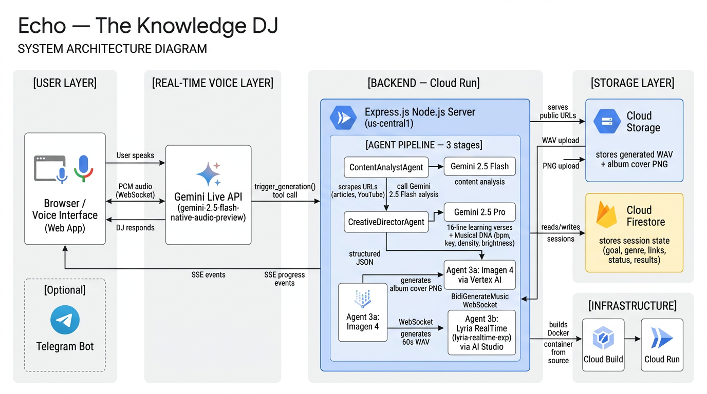

# Echo — System Architecture & Flowchart

## 1. System Architecture Diagram



---

## 2. Data Model (Firestore)

```
sessions/{chatId}
├── chatId: string
├── username: string
├── goal: string          ← learning topic
├── genre: string         ← music genre
├── links: string[]       ← source URLs
├── status: "pending" | "processing" | "completed" | "error"
├── created_at: timestamp
└── generation_results:
    ├── track_title: string    ← short catchy song name (3-5 words)
    ├── lyrics: string         ← AI-written learning verses (Gemini 2.5 Pro)
    ├── image_url: string      ← GCS public URL (Imagen 4 album cover)
    ├── audio_url: string      ← GCS public URL (Lyria WAV track)
    ├── audio_mime_type: string ← e.g. "audio/wav" or "audio/mpeg"
    ├── image_prompt: string
    └── musical_dna:
        ├── bpm: string
        ├── mood: string
        └── key: string
```

---

## 3. Bug Fixes Applied

| Bug | Root Cause | Fix |
|-----|-----------|-----|
| Frontend never redirected to result page after pipeline complete | `live-session.js` sent absolute `digestUrl` (`http://host/digest/id`); client security check required relative path starting with `/` so `dest` was always `null` | Changed server to send `/digest/${chatId}` (path only, no origin) |
| Result page showed no track title | `track_title` field existed in `generation_results` but was never rendered | Added `<div class="track-title">` in hero block of result page |

---

## 4. Result Page Design (Spotify-inspired)

```
┌─────────────────────────────────────────┐
│  ECHO nav                  + New Track  │
├─────────────────────────────────────────┤
│  [blurred album bg — full page]         │
│                                         │
│       [Album Art 220×220]               │
│    Track Title Here                     │
│    🎯 Web3 security  •  🎵 Synthwave    │
│    BPM 120  •  Mood: Focused  •  C Maj  │
│                                         │
│  ─── LYRICS ────────────────────────── │
│    line 1 (dim)                         │
│    LINE 2 ACTIVE (large, accent)        │
│    line 3 (near — medium)               │
│    line 4 (dim)                         │
│                                         │
├─────────────────────────────────────────┤
│ [art] Track Title    ▶  ──●──  0:23/1:00│  ← sticky player bar
│       Genre               [Download]   │
└─────────────────────────────────────────┘
```

Key features:
- Blurred album art as page background (`filter: blur(80px) brightness(0.18)`)
- Lyric lines: `active` (large, full color) / `near` (adjacent lines, medium) / dim (rest)
- Custom player bar: play/pause SVG swap, scrubable progress track, keyboard seek (←→ ±5s, Space)
- `+ New Track` nav link routes back to `/live`
