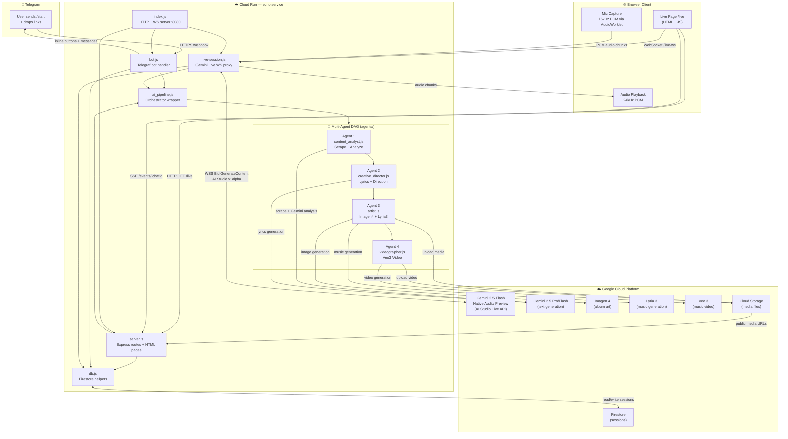
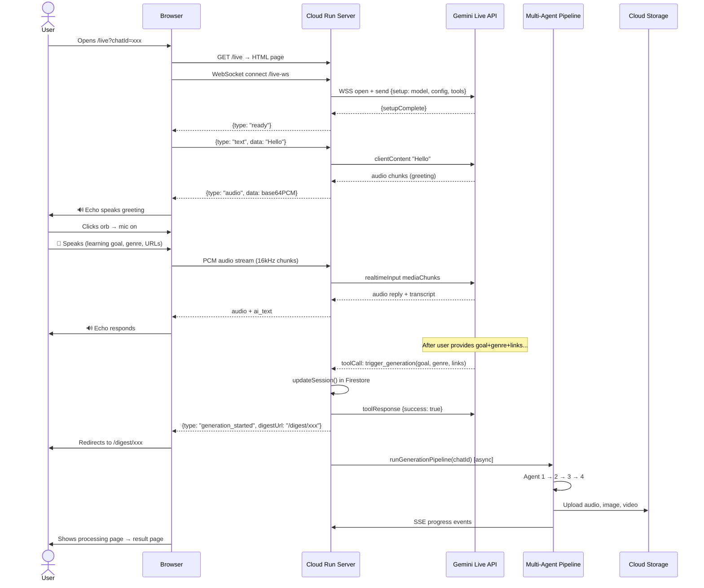
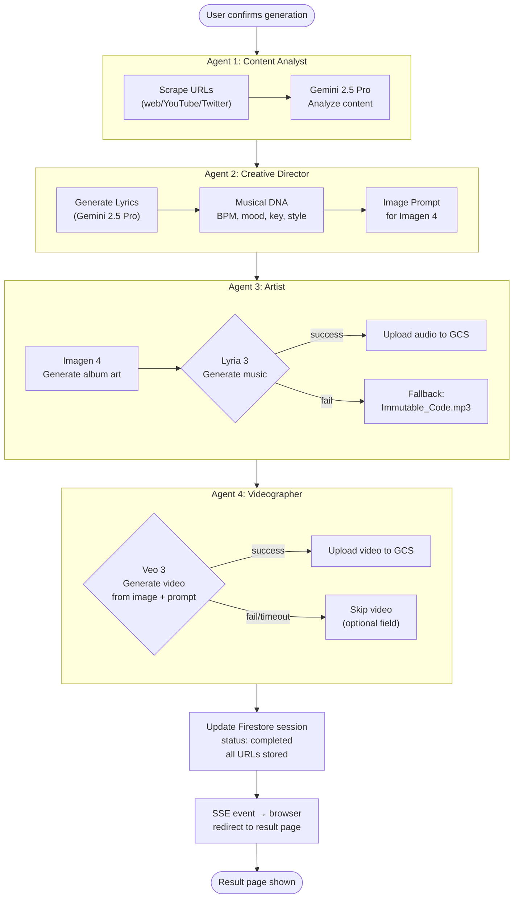

# Echo — System Architecture & Flowchart

## 1. System Architecture Diagram



---

## 2. User Flow — Voice Onboarding (Gemini Live)



---

## 3. Generation Pipeline Flowchart



---

## 4. Data Model (Firestore)

```
sessions/{chatId}
├── chatId: string
├── username: string
├── goal: string          ← learning topic
├── genre: string         ← music genre
├── links: string[]       ← source URLs
├── status: "pending" | "processing" | "completed" | "error"
├── created_at: timestamp
└── generation_results:
    ├── lyrics: string
    ├── image_url: string      ← GCS public URL
    ├── audio_url: string      ← GCS public URL
    ├── video_url: string      ← GCS public URL (optional)
    ├── image_prompt: string
    └── musical_dna:
        ├── bpm: string
        ├── mood: string
        └── key: string
```
